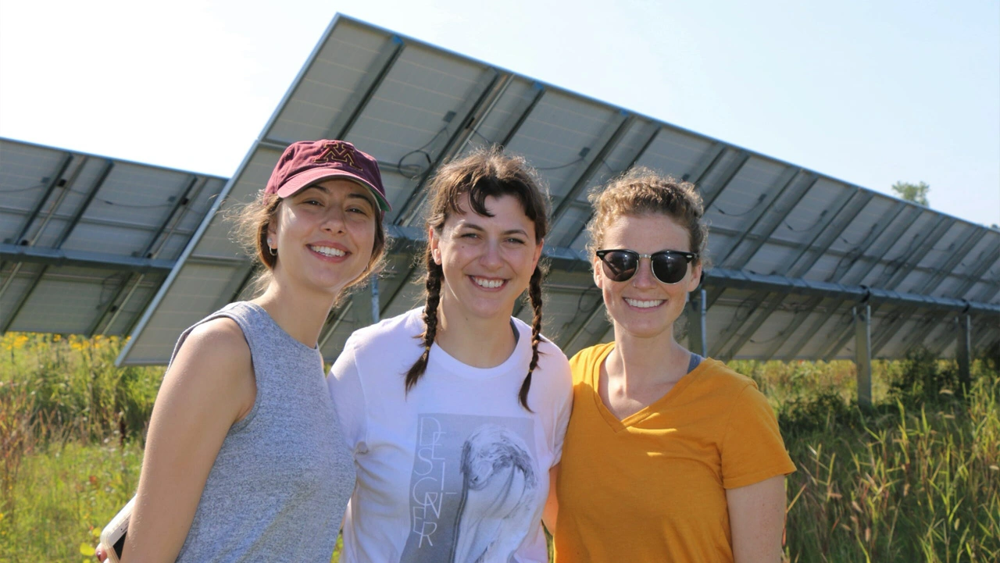
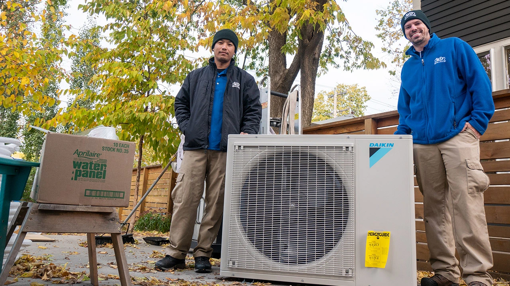
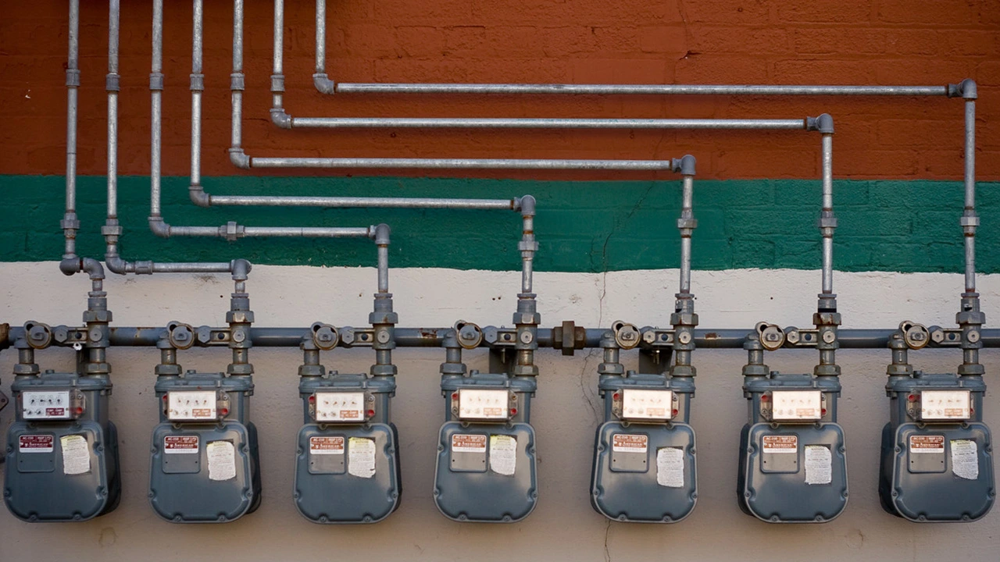
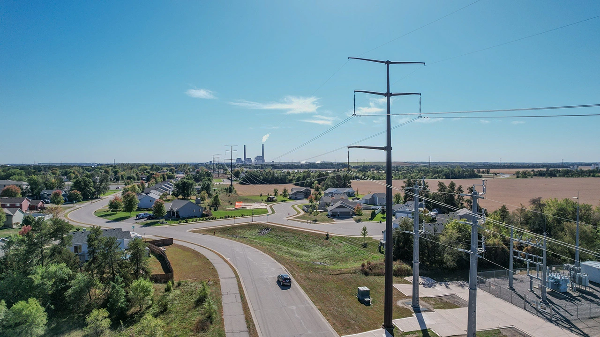
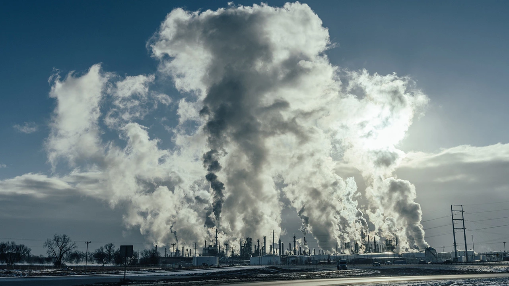
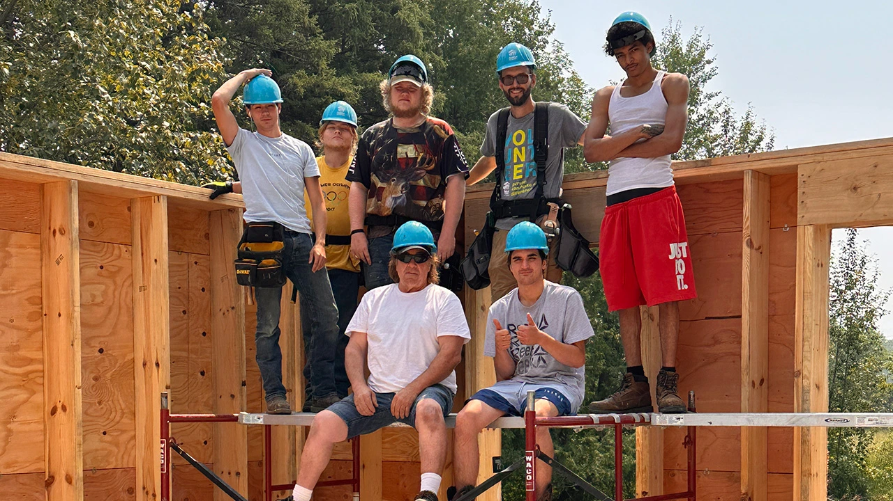
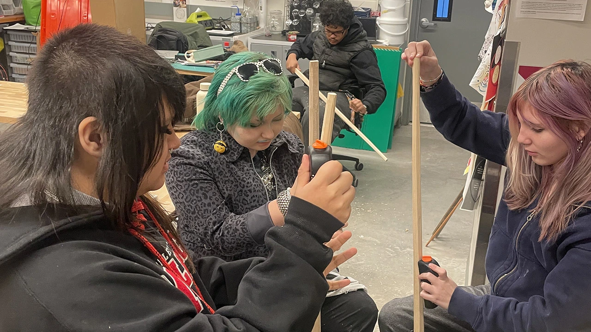
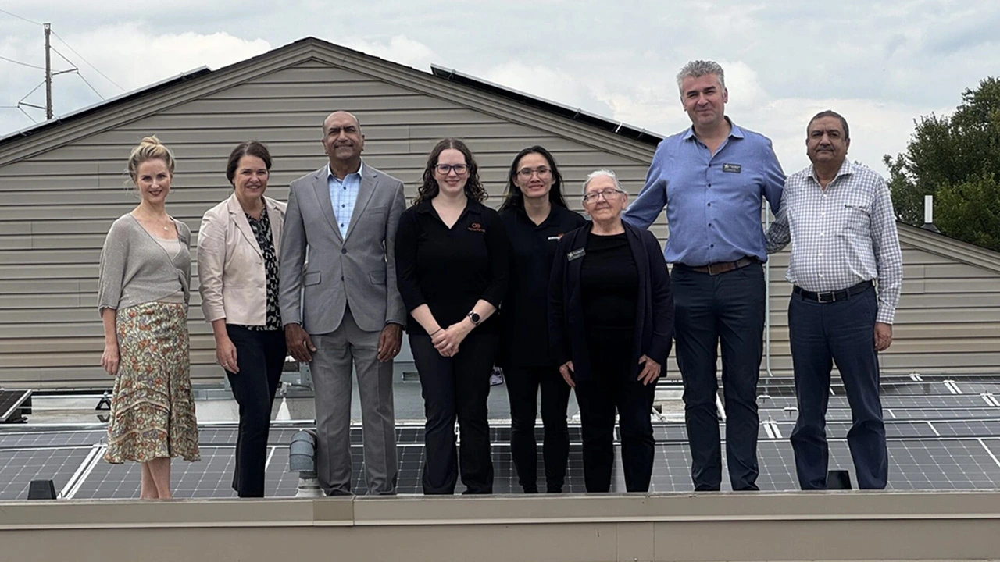
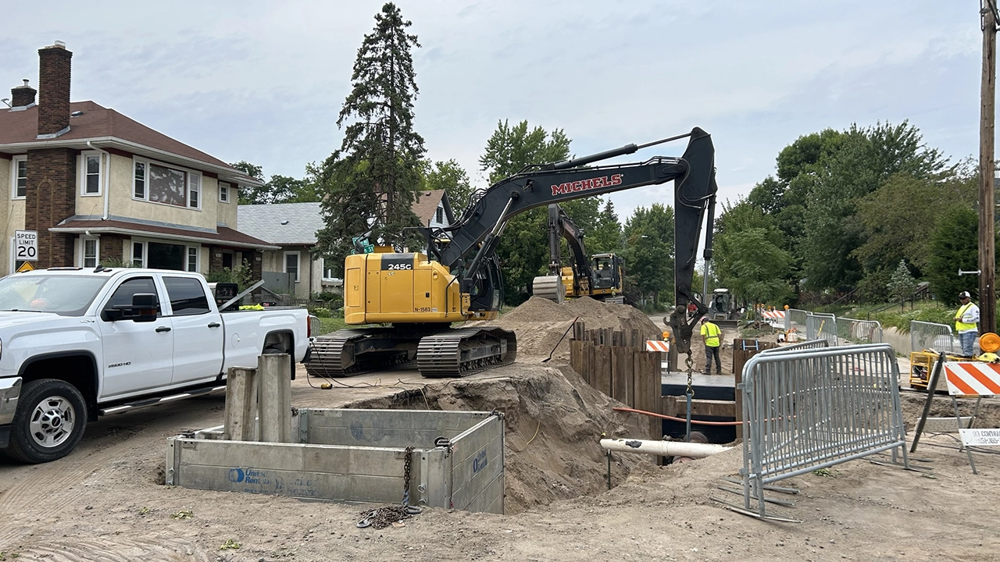
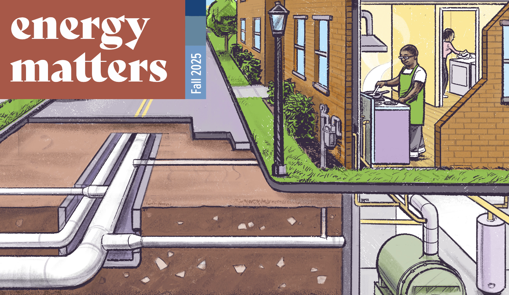

## Climate Policy

Translating complex climate policy for technical stakeholders and general audiences, making Minnesota's energy transition accessible without sacrificing accuracy.

  

    <a href="https://fresh-energy.org/minnesota-now-incentivizes-green-hydrogen-to-produce-saf-a-key-climate-technology" target="_blank">
      
      <strong>Minnesota now incentivizes green hydrogen to produce SAF, a key climate technology</strong>
    </a>
  

    

      <a href="https://fresh-energy.org/minnesotas-electricity-is-now-50-percent-carbon-free" target="_blank">
        
        <strong>Minnesota’s electricity is now 50% carbon-free — here’s what that means</strong>
      </a>
    

  

    <a href="https://fresh-energy.org/its-time-for-a-minnesota-heat-standard-to-decarbonize-buildings" target="_blank">
      
      <strong>It’s time for a heat standard program to decarbonize buildings</strong>
    </a>
  

 

## Energy Messaging for General Audiences

Distilling complex energy topics into clear, persuasive talking points that everyday supporters can understand, repeat, and use in real conversations.

  

    <a href="https://fresh-energy.org/minnesota-shouldnt-invest-in-gas-line-extensions-during-an-affordability-squeeze" target="_blank">
      
      <strong>Minnesota shouldn’t invest in gas line extensions during an affordability squeeze</strong>
    </a>
  

  

	 <a href="https://fresh-energy.org/whats-really-driving-up-electricity-costs-and-what-isnt" target="_blank">
      
      <strong>What’s really driving up electricity costs (and what isn’t)</strong>
    </a>
  

  

    <a href="https://fresh-energy.org/the-true-cost-of-oil" target="_blank">
    
      <strong>The true cost of oil</strong>
    </a>
  

 

## Clean Energy Storytelling

Humanizing the energy transition through on-the-ground profiles of people and organizations making the switch, connecting abstract climate goals to lived, relatable experiences.

  

    <a href="https://fresh-energy.org/could-this-cohasset-home-be-the-future-of-minnesotas-buildings" target="_blank">
      
      <strong>Could this Cohasset home be the future of Minnesota’s buildings?</strong>
    </a>
  

  

	 <a href="https://fresh-energy.org/migizi-teaches-indigenous-youth-dangers-of-gas-use-importance-of-advocacy" target="_blank">
      
      <strong>MIGIZI teaches Indigenous youth dangers of gas use, importance of advocacy</strong>
    </a>
  

  

    <a href="https://fresh-energy.org/minnesota-is-building-innovative-climate-projects-through-new-state-agencys-green-financing" target="_blank">
    
      <strong>Minnesota is building innovative climate projects through new state agency’s green financing</strong>
    </a>
  

 

## Reports

Providing technical deep-dives for energy professionals and conversational features for general audiences, including regulatory analyses and programmatic summaries.

  

    <a href="https://fresh-energy.org/publication/white-paper-whats-up-with-data-centers-minnesota" target="_blank">
      
      <strong>What’s up with data centers in Minnesota?</strong>
    </a>
  

  

	 <a href="https://fresh-energy.org/publication/understanding-the-gas-system" target="_blank">
      
      <strong>Minnesota’s growing decarbonization challenge is hidden beneath our feet</strong>
    </a>
  

  

   <a href="https://fresh-energy.org/publication/fall-2025" target="_blank">
      
      <strong>Energy Matters | Fall 2025</strong>
    </a>
  

 
 

<a href="/complete-portfolio">
<strong>Complete portfolio →</strong>
</a>

 
 
